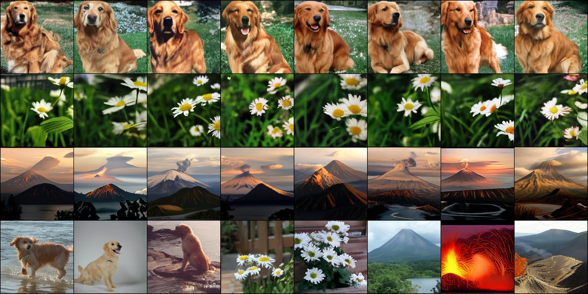

# Prologue: Autoregressive Visual Generation Needs a Prologue

**Paper:** [arXiv 2605.06137](https://arxiv.org/abs/2605.06137)  ·  **Code:** [github.com/Zyriix/prologue](https://github.com/Zyriix/prologue)  ·  **Demo:** [🤗 Space](https://huggingface.co/spaces/Zyriix/prologue-demo)

Bowen Zheng · Weijian Luo · Guang Yang · Colin Zhang · Tianyang Hu



> **Image = `[prologue tokens] + [visual tokens]`.** Prologue tokens are a small set of latent tokens prepended to the visual sequence and trained **only** with the AR cross-entropy loss. Visual tokens stay dedicated to reconstruction. The reconstruction–generation gap closes for free, and prologue tokens spontaneously develop semantic structure under pure CE gradients.

Generated with Prologue-L–XL. **Top three rows:** each row holds all 16 prologue tokens fixed while resampling only the visual tokens. Class identity and global layout stay locked, fine texture varies across columns. **Bottom row:** samples drawn from **different** prologue tokens, shown for reference.

---

## Headline numbers on ImageNet 256×256

| Model                       |   AR | rFID ↓ | gFID ↓ | gFID<sub>noCFG</sub> ↓ |  IS ↑ | Pre. ↑ | Rec. ↑ |
|-----------------------------|-----:|-------:|-------:|-----------------------:|------:|-------:|-------:|
| 1D Tokenizer (no CE)        | 115M |  2.11  |  6.10  |   19.32                |   —   |   —    |   —    |
| 2D Tokenizer (no CE)        | 115M |  2.15  |  5.02  |   21.01                |   —   |   —    |   —    |
| **Prologue B–B**            | 115M |  2.24  | **4.11** | **10.75**            | 210.3 |  0.83  |  0.48  |
| **Prologue B–L**            | 305M |  2.24  | **2.67** | **6.56**             | 251.2 |  0.82  |  0.56  |
| **Prologue B–XL**           | 685M |  2.24  | **2.43** | **5.22**             | 252.6 |  0.80  |  0.59  |
| **Prologue L–B**            | 115M |  0.99  | **2.15** | **5.02**             | 219.9 |  0.79  |  0.60  |
| **Prologue L–L**            | 305M |  0.99  | **1.52** | **2.81**             | 251.6 |  0.77  |  0.66  |
| **Prologue L–XL**           | 685M |  0.99  | **1.46** | **2.26**             | 257.7 |  0.78  |  0.66  |
| Prologue-Post (frozen 2D)   | 115M |  2.15  |  3.88  |   11.04                |   —   |   —    |   —    |
| Prologue-OneStage (joint)   | 115M |  2.09  |  5.41  |   21.00                |   —   |   —    |   —    |

All numbers are reproducible end-to-end with `bash eval.sh` in the GitHub repo. *gFID / IS* follow the [ADM evaluation protocol](https://github.com/openai/guided-diffusion/tree/main/evaluations) (50k samples vs `VIRTUAL_imagenet256_labeled.npz`).

---

## What's in this repo

This Hugging Face Hub repository hosts **all released weights** for the paper: 6 tokenizers and 9 AR models (~63 GB total). The matching code, training scripts, and full documentation live on [GitHub](https://github.com/Zyriix/prologue).

### Tokenizers (6 directories)

| Directory                 | rFID | Size   | Note                                                                                          |
|---------------------------|-----:|-------:|-----------------------------------------------------------------------------------------------|
| `1d-tokenizer`            | 2.11 | 3.2 GB | 1D baseline, z_len = 256                                                                      |
| `2d-tokenizer`            | 2.15 | 3.2 GB | 2D baseline, z_len = 256                                                                      |
| `prologue-b-tokenizer`    | 2.24 | 4.1 GB | Prologue Base; VGG-LPIPS; codebook = 16 384                                                   |
| `prologue-l-tokenizer`    | 0.99 | 6.7 GB | Prologue Large; ConvNeXt-logit; codebook = 4096; asymmetric decoder 24×1024                   |
| `prologue-post-tokenizer` | 2.15 | 3.2 GB | Prologue-Post (frozen 2D + new prologue path)                                                 |
| `prologue-onestage-joint` | 2.09 | 5.5 GB | Joint AE + AR-Base, single-stage. AR shards live inside as `model_5.safetensors` / `model_6.safetensors`. |

### AR models (9 directories)

| Directory            | Pair with                  | Size   | AR params | gFID (CFG) | gFID (no CFG) |
|----------------------|----------------------------|-------:|----------:|-----------:|--------------:|
| `ar-1d-base`         | `1d-tokenizer`             | 1.8 GB |      115M |       6.10 |         19.32 |
| `ar-2d-base`         | `2d-tokenizer`             | 1.8 GB |      115M |       5.02 |         21.01 |
| `ar-prologue-b-b`    | `prologue-b-tokenizer`     | 1.8 GB |      115M |       4.11 |         10.75 |
| `ar-prologue-b-l`    | `prologue-b-tokenizer`     | 5.3 GB |      305M |       2.67 |          6.56 |
| `ar-prologue-b-xl`   | `prologue-b-tokenizer`     |  11 GB |      685M |       2.43 |          5.22 |
| `ar-prologue-l-b`    | `prologue-l-tokenizer`     | 1.5 GB |      115M |       2.15 |          5.02 |
| `ar-prologue-l-l`    | `prologue-l-tokenizer`     | 4.9 GB |      305M |       1.52 |          2.81 |
| `ar-prologue-l-xl`   | `prologue-l-tokenizer`     | 9.9 GB |      685M |       1.46 |          2.26 |
| `ar-prologue-post-b` | `prologue-post-tokenizer`  | 1.8 GB |      115M |       3.88 |         11.04 |

The AR-XL config (`configs/ar/xlarge.yaml`) used in all our experiments is `32 layers × 1280 dim × 20 heads`; the `24 × 2048` shape in paper Tab `tab:model_config` is a typo in the table. The reported results are unaffected.

All checkpoints are [`safetensors`](https://github.com/huggingface/safetensors) following the 🤗 Accelerate convention (`model.safetensors`, `model_1.safetensors`, …). After download the layout matches the relative paths expected by `eval.sh` / `app.py` in the code repo, so no `mv` step is required.

---

## Download

```bash
pip install -U "huggingface_hub[cli]"
export HF_XET_HIGH_PERFORMANCE=1   # parallel Xet transfer

# everything (~63 GB)
hf download Zyriix/prologue --local-dir ckpts

# or just the headline model used by the demo (LXL, 9.9 GB + 6.7 GB tokenizer)
hf download Zyriix/prologue \
    --include "ar-prologue-l-xl/*" \
    --include "prologue-l-tokenizer/*" \
    --local-dir ckpts
```

See the [GitHub README](https://github.com/Zyriix/prologue#released-checkpoints) for per-model commands and an inference-only slim layout (drops the ~50 % of bytes used for resuming training).

---

## How to use

```bash
git clone https://github.com/Zyriix/prologue.git && cd prologue
bash setup_env.sh && conda activate prologue

# unpack the released ckpts (see above)
hf download Zyriix/prologue \
    --include "ar-prologue-l-xl/*" \
    --include "prologue-l-tokenizer/*" \
    --local-dir ckpts

# (a) full headline-table reproduction
bash eval.sh

# (b) interactive Gradio demo: fix prologue, resample visual
python app.py
```

Programmatic loading inside Python:

```python
from huggingface_hub import snapshot_download
ckpt_dir = snapshot_download(
    repo_id="Zyriix/prologue",
    allow_patterns=["ar-prologue-l-xl/*", "prologue-l-tokenizer/*"],
    local_dir="ckpts",
    max_workers=8,
)
# Then call into prologue/ as a library (load_models / sample_tokens):
#   from sample_vis import load_models, sample_tokens
#   See app.py for a full minimal example.
```

---

## Model details

- **Architecture.** Causal Transformer AR over a **prologue prefix (z_len = 16, separate codebook)** and a **2D visual sequence (x_len = 256 = 16 × 16, codebook = 4096 or 16 384)**. Conditioning is class-label one-hot injected as a BOS embedding (LlamaGen style). RoPE positions, RMSNorm, GeGLU FFN.
- **Tokenizer.** ViT-style encoder/decoder with simvq codebook (Yu et al.). Prologue variants share the encoder; Prologue-Post freezes a 2D visual tokenizer and adds a second prologue path on top.
- **Training stage 1, tokenizer + joint AR head.** L1 + LPIPS (or ConvNeXt-logit for L variants) + PatchGAN. The AR head is trained with cross-entropy on `[prologue ; visual]`; STE through the prologue codebook flows gradients into the encoder. **Base: 150 epochs / Large: 200 epochs, both at batch size 256.**
- **Training stage 2, pretokenize.** One pass over ImageNet, cache token indices to sharded `.npz`.
- **Training stage 3, large AR.** Cross-entropy only, on the cached tokens. **AR-Base: 400 epochs at batch 512 · AR-Large: 800 epochs at batch 2048**, aligned with [AliTok](https://github.com/ali-vilab/alitok). Supports separate temperatures and separate CFG schedules for prologue / visual.
- **Numerics.** BF16 mixed precision, `torch.compile`, flash-attn 2.8 (source-built against torch 2.9.1 + cu128).
- **Compute.** Paper numbers were run on 8× H100 80 GB; the released training and eval scripts auto-scale to any (1× or 8×) configuration via 🤗 Accelerate.

---

## Intended use, limitations, and risks

- **Intended use.** Research on discrete image tokenization, AR image generation, and the role of semantic prefixes in token sequences. The released models are class-conditional on the 1 000 ImageNet classes only; there is no text conditioning.
- **Out-of-distribution behaviour.** Samples for classes that are visually similar to ImageNet categories are best; the model has no notion of arbitrary text prompts, layout, or style.
- **Failure modes.** Like all AR image models, the model occasionally produces anatomical / object artifacts, particularly under aggressive (high-CFG) sampling. Prologue prefixes constrain global layout but not fine-grained correctness.
- **Bias.** ImageNet-1k itself contains known social and cultural biases; downstream generation inherits them. Do not deploy these weights for any application affecting individuals' lives, in any high-stakes setting, or as input to face-related pipelines.
- **License.** Apache-2.0 for the weights and the bulk of the code, subject to ImageNet's [terms of use](https://www.image-net.org/download.php). See [`NOTICE`](https://github.com/Zyriix/prologue/blob/main/NOTICE) for the CC BY-NC-SA 4.0 carve-out on four NVIDIA StyleGAN3-derived files.

---

## Citation

```bibtex
@misc{zheng2026autoregressivevisualgenerationneeds,
      title={Autoregressive Visual Generation Needs a Prologue},
      author={Bowen Zheng and Weijian Luo and Guang Yang and Colin Zhang and Tianyang Hu},
      year={2026},
      eprint={2605.06137},
      archivePrefix={arXiv},
      primaryClass={cs.CV},
      url={https://arxiv.org/abs/2605.06137},
}
```

## Acknowledgements

Inspired by (chronological)
[LPIPS](https://github.com/richzhang/PerceptualSimilarity) (2018) ·
[vector-quantize-pytorch](https://github.com/lucidrains/vector-quantize-pytorch) (2020) ·
[VQGAN / taming-transformers](https://github.com/CompVis/taming-transformers) (2020) ·
[guided-diffusion](https://github.com/openai/guided-diffusion) (2021) ·
[VAR](https://github.com/FoundationVision/VAR) (2024.04) ·
[LlamaGen](https://github.com/FoundationVision/LlamaGen) (2024.06) ·
[TiTok](https://github.com/bytedance/1d-tokenizer) (2024.06) ·
[Open-MAGVIT2](https://github.com/TencentARC/Open-MAGVIT2) (2024.09) ·
[ImageFolder](https://github.com/lxa9867/ImageFolder) (2024.10) ·
[AliTok](https://github.com/ali-vilab/alitok) (2025.06).
