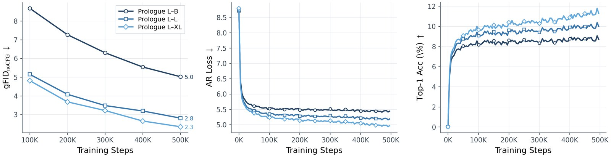
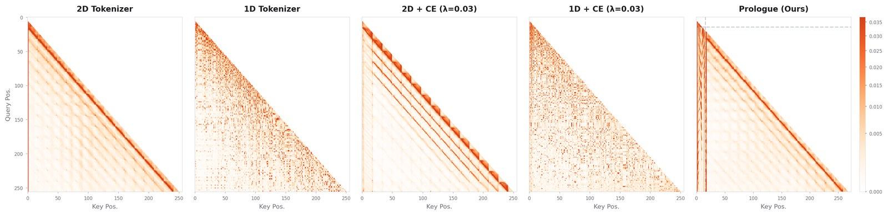
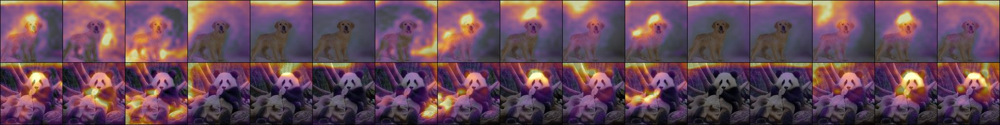

<div align="center">

# Autoregressive Visual Generation Needs a Prologue

**Official implementation** of
[Autoregressive Visual Generation Needs a Prologue](https://arxiv.org/abs/2605.06137) (arXiv:2605.06137).

Bowen Zheng &nbsp;·&nbsp; Weijian Luo &nbsp;·&nbsp; Guang Yang &nbsp;·&nbsp; Colin Zhang &nbsp;·&nbsp; Tianyang Hu

[](https://arxiv.org/abs/2605.06137)
[](https://huggingface.co/Zyriix/prologue)
[](https://huggingface.co/spaces/Zyriix/prologue-demo)
[](https://www.python.org/downloads/release/python-3120/)
[](https://pytorch.org/)
[](LICENSE)

👉 **[Try the live demo on Hugging Face Spaces](https://huggingface.co/spaces/Zyriix/prologue-demo).** Pick a class, draw fresh samples, or fix the prologue and resample only the visual tokens.


*Generated with Prologue-L–XL. **Top three rows:** each row holds all 16 prologue tokens fixed while resampling only the visual tokens. Class identity, viewpoint, color palette, and overall layout stay locked, while fine texture varies across columns. **Bottom row:** samples drawn from **different** prologue tokens, shown for reference. The semantic-vs-detail division emerges purely from AR cross-entropy gradients, with no semantic supervision.*

</div>

---

## TL;DR

> **Image = `[prologue tokens] + [visual tokens]`.**
> Prologue tokens are a *small* set of latent tokens prepended to the visual sequence and trained **only** with the AR cross-entropy loss. Visual tokens stay dedicated to reconstruction. The reconstruction–generation gap closes for free, and prologue tokens spontaneously develop semantic structure under pure CE gradients.

**Headline numbers on ImageNet 256×256 (paper Tab `tab:main` / Tab `tab:sota`):**

| Model | AR | rFID ↓ | gFID ↓ | gFID<sub>noCFG</sub> ↓ | IS ↑ | Pre. ↑ | Rec. ↑ |
|---|---:|---:|---:|---:|---:|---:|---:|
| 1D Tokenizer (no CE)        | 115M | 2.11 | 6.10 | 19.32 | — | — | — |
| 2D Tokenizer (no CE)        | 115M | 2.15 | 5.02 | 21.01 | — | — | — |
| **Prologue B–B**            | 115M | 2.24 | **4.11** | **10.75** | 210.3 | 0.83 | 0.48 |
| **Prologue B–L**            | 305M | 2.24 | **2.67** | **6.56**  | 251.2 | 0.82 | 0.56 |
| **Prologue B–XL**           | 685M | 2.24 | **2.43** | **5.22**  | 252.6 | 0.80 | 0.59 |
| **Prologue L–B**            | 115M | 0.99 | **2.15** | **5.02**  | 219.9 | 0.79 | 0.60 |
| **Prologue L–L**            | 305M | 0.99 | **1.52** | **2.81**  | 251.6 | 0.77 | 0.66 |
| **Prologue L–XL**           | 685M | 0.99 | **1.46** | **2.26**  | 257.7 | 0.78 | 0.66 |
| Prologue-Post (frozen 2D)   | 115M | 2.15 | 3.88 | 11.04 | — | — | — |
| Prologue-OneStage (joint)   | 115M | 2.09 | 5.41 | 21.00 | — | — | — |

**Evaluation protocol.** *rFID* is computed on the ImageNet validation set; the trainer caches the reference statistics on the first eval and re-uses them (**no download required**). *gFID / IS* follow the [ADM protocol](https://github.com/openai/guided-diffusion/tree/main/evaluations): 50k samples from the model are compared against the ADM virtual reference batch `VIRTUAL_imagenet256_labeled.npz`. Download that file from the [linked page](https://github.com/openai/guided-diffusion/tree/main/evaluations) and set `eval_fid_ref_path=<path>` (or hand it to `eval.sh`). All numbers above are reproducible end-to-end with `bash eval.sh`.

---

## Why this repo?

**Stop building your own tokenizer infra.** If you work on discrete image tokenization or AR image generation, this repo is a one-stop, paper-grade base you can drop your research idea into.

- **One command per stage.** `bash train.sh` runs the full `tokenizer → pretokenize → AR → gFID` pipeline. `bash eval.sh` runs every CFG sweep. No glue code, no hand-wired ckpt paths; `pipeline_utils.sh` resolves everything by name.
- **BF16 + `torch.compile` + Flash-Attention 2.8** are on by default in `configs/default.yaml`. Compatible with HF Accelerate DDP / FSDP via `accelerate launch`.
- **Training-time gFID.** Every `eval_freq` AR steps (default 100k), the trainer spawns an in-process sampler + TF Inception worker and writes `gFID` / `gFID_noCFG` / `IS` straight to W&B. No `--eval_only` reruns needed to track convergence.
- **Pretokenization stage** decouples tokenizer forward from AR training (`train_pretoken.py`). AR steps stay GPU-bound and scale linearly with GPUs; tokenizer never re-runs.
- **Detailed tokenizer metrics.** Per-position codebook usage histograms, sample-entropy, batch-entropy, aggregated entropy, quant loss, codebook-norm, latent-norm; all logged per step. Per-position usage heatmap rendered to W&B every `visualize_freq`.
- **Modular tokenizer modes**, same codebase:
  - **1D** (`configs/tokenizer/1d.yaml`): z_len=256, no spatial bias.
  - **2D** (`configs/tokenizer/2d.yaml`): z_len=256 with 2D RoPE.
  - **Prologue** (`configs/tokenizer/prologue.yaml`): 16 prologue tokens (1D) + 256 visual tokens (2D), separate codebooks, *shared* encoder.
  - **Prologue-Post** (`configs/tokenizer/prologue_post.yaml`): freezes a pretrained 2D pathway and *adds* the prologue path on top.
- **AR scaling**: drop-in Small / Base / Large / XLarge configs (`configs/ar/{small,base,large,xlarge}.yaml`); released checkpoints span Base (115M) to XLarge (685M). Switching to the asymmetric L-series decoder (`Decoder.dim=1024 Decoder.layer_num=24`) is a CLI override.
- **Battery-included GAN losses** in `model_gan.py`:
  - Discriminators: **PatchGAN** (Pix2Pix), **StyleGAN-D**, **DINO-S** (`dinodisc`).
  - Losses: vanilla / hinge / non-saturating, with **LeCam** regularization and **R1** gradient penalty.
  - Perceptual: LPIPS-VGG16, ConvNeXt-S logit loss, or both (`perceptual_network: vgg | convnext | both`).
- **Joint single-stage training** is supported (`Prologue-OneStage`): AE + AR co-trained from scratch with one launcher, no two-stage choreography.
- **Reproducible from scratch.** `setup_env.sh` builds the validated env (Python 3.12, torch 2.9.1+cu128, flash-attn 2.8.3 source-build, pinned `requirements.txt`).

---

## Visual results

<table>
<tr><td align="center">
<br/>
<sub><b>Training dynamics.</b> Loss / accuracy / gFID<sub>noCFG</sub> all improve monotonically with AR scale; gFID is logged live every 100k steps during AR training.</sub>
</td></tr>
<tr><td align="center">
<br/>
<sub><b>AR attention (Layer 7).</b> (a) 2D-Tok preserves spatial locality. (c) CE on shared visual tokens <em>destroys</em> it: the 2D order conflicts with the 1D AR raster. (e) Prologue keeps the 2D local pattern <em>and</em> adds clean prologue-prefix attention (vertical stripes); the AR model spontaneously uses prologue tokens as global context.</sub>
</td></tr>
<tr><td align="center">
<br/>
<sub><b>Per-prologue-token attention heatmaps</b> (Prologue-L–XL; last 8 AR layers, all heads averaged). For each class, the leftmost panel is the generated image; the remaining 16 panels show where each prologue token is attended from in pixel space. Different tokens specialize in different regions: a learned spatial division of labor, with <em>no</em> supervision targeting it.</sub>
</td></tr>
</table>

---

## Repository structure

```
prologue/
├── train_tokenizer.py     # Tokenizer (AE) + optional joint AR trainer  (Phase 1)
├── train_pretoken.py      # Pretokenize the dataset to .npz             (Phase 2)
├── train_ar.py            # Standalone AR trainer (also serves eval)    (Phase 3)
├── models.py              # Encoder, Decoder, ARModel, Quantizer, PrologueQuantizer
├── model_gan.py           # PatchGAN / StyleGAN-D / DinoDisc + LPIPS + LeCam + R1
├── model_lpips.py         # LPIPS-VGG16 (+ ConvNeXt-S logit loss in models.py)
├── dataset.py             # ImageFolder / LMDB loader
├── evaluator.py           # gFID / IS / precision / recall
├── eval_fid.py            # Spawned TF-Inception FID worker (paper-exact)
├── pipeline_utils.sh      # run_full_pipeline / sweep_cfg / ckpt resolvers
├── train.sh               # Reproduces every training run in the paper
├── eval.sh                # Reproduces every CFG sweep in the paper
├── setup_env.sh           # Bootstraps the validated conda env (Py3.12 + cu128)
├── requirements.txt
└── configs/
    ├── default.yaml
    ├── tokenizer/         # 1d / 2d / prologue / prologue_post
    ├── ar/                # small / base / large / xlarge (+_defaults)
    └── train/             # ae / ar / eval_ae / eval_ar / post_overlay
```

---

## Quick start

### 1. Environment

```bash
git clone https://github.com/Zyriix/prologue.git && cd prologue
bash setup_env.sh                  # creates conda env "prologue"
conda activate prologue
```

The setup script anchors `torch==2.9.1+cu128` via xformers, installs the cuda-12.8 nvcc, source-builds `flash-attn==2.8.3`, then installs the rest of `requirements.txt`. Requires an NVIDIA driver supporting CUDA 12.8 (>= 525.x).

### 2. Data

**No preprocessing. No extraction. Point the trainer at the raw ImageNet zip.**

Grab `imagenet-object-localization-challenge.zip` (~155 GB) from Kaggle's [ImageNet Object Localization Challenge](https://www.kaggle.com/c/imagenet-object-localization-challenge). Accept the competition rules, then either click "Download All" or use the CLI:

```bash
pip install -U kaggle           # one-time
kaggle competitions download -c imagenet-object-localization-challenge -p data/
# -> data/imagenet-object-localization-challenge.zip
```

That's it. `configs/default.yaml` already points at the zip:

```yaml
data_dir:      data/imagenet-object-localization-challenge.zip/ILSVRC/Data/CLS-LOC/train
eval_data_dir: data/imagenet-object-localization-challenge.zip/ILSVRC/Data/CLS-LOC/val
```

[`dataset.py`](dataset.py) auto-detects the `.zip` extension and reads images straight from the archive; [`dataset_tools.py`](dataset_tools.py) parses train/val class labels from the metadata already inside the zip and writes a tiny `dataset.json` *into the zip* on first use. No unzip, no `ImageFolder` symlinks, no class-mapping script.

For paper-exact gFID, also fetch `VIRTUAL_imagenet256_labeled.npz` from the [ADM evaluations page](https://github.com/openai/guided-diffusion/tree/main/evaluations) and set `eval_fid_ref_path=<path>`. rFID needs nothing extra; the trainer auto-computes its reference statistics from the val zip on first eval and caches them.

### 3. Train

The whole paper is reproducible by sourcing `pipeline_utils.sh`. Each call runs *tokenizer → pretokenize → AR* with one line:

```bash
source pipeline_utils.sh

# 2D baseline (tokenizer + AR-Base)
run_full_pipeline "$TOK_2D" "2D-Baseline" ae_no_label=True \
    phases=1500000:DO_L1-DO_LPIPS-DO_GAN_G,DO_GAN_D:1,1

# Prologue-Base tokenizer + AR-Base / Large / XLarge
run_full_pipeline "$TOK_Prologue" stages=1,2 "Prologue-B-Tokenizer" \
    prior_enc_semantic_weight=3.0 prior_enc_visual_weight=3.0 \
    ARModel.ste_ar_embedding=True SemanticQuantizer.temperature=0.1 \
    use_eos=True prior_visual_dropout=0.5 ae_no_label=True \
    stage1.label_drop_prob=1.0 stage1.ARModel.tied_embedding=False stage1.ARModel.layer_num=7

AR=$AR_B  run_full_pipeline "$TOK_Prologue" stages=3 "Prologue-B-B"  ...
AR=$AR_L  run_full_pipeline "$TOK_Prologue" stages=3 "Prologue-B-L"  ...
AR=$AR_XL run_full_pipeline "$TOK_Prologue" stages=3 "Prologue-B-XL" ...
```

The complete reproduction script is [`train.sh`](train.sh).

### 4. CFG sweep + gFID

```bash
source pipeline_utils.sh
# semantic CFG = const, visual CFG = cosine schedule
AR=$AR_B sweep_cfg "$TOK_Prologue" "Prologue-B-B" \
    ARModel.ste_ar_embedding=True SemanticQuantizer.temperature=0.1 \
    use_eos=True prior_visual_dropout=0.5 ae_no_label=True \
    cfg_grid="sc:0.7:3.75:0.2 nt2:0.7:0.9"
```

`cfg_grid` entries: `oc:<cfg>:<power>` (overall cosine), `sc:<spro>:<svis>:<vpower>` (split CFG), `nt:<temp>` (no-CFG), `nt2:<stemp>:<vtemp>` (split temperatures). Full reproduction in [`eval.sh`](eval.sh).

### 5. Inference only (no retraining)

`eval.sh` runs every released `(tokenizer, AR, cfg-point)` combination back-to-back and reproduces the paper tables against the ADM virtual reference. It expects checkpoints under `ckpts/<friendly-name>/`; see [Released checkpoints](#released-checkpoints) for the per-model layout and download commands.

```bash
bash eval.sh                          # everything (~14h on 2×H100)
# Edit eval.sh to comment out rows you do not need; each row is one
# `sweep_cfg` call and the configuration is self-explanatory.
```

### 6. Interactive demo (Gradio)

`app.py` wraps **Prologue-L–XL** in a small Gradio UI showing the qualitative property that motivates the method: prologue tokens carry class identity + global layout; visual tokens carry texture. Two buttons:

1. **Resample all**: draw fresh prologue + visual tokens for the selected class.
2. **Resample visual only**: keep the prologue tokens from step 1, redraw only the visual suffix.

```bash
# point at the unpacked Prologue-L tokenizer + AR-L-XL ckpt (see Released checkpoints)
export PROLOGUE_TOK_CKPT=/path/to/prologue-l-tokenizer
export PROLOGUE_AR_CKPT=/path/to/ar-prologue-l-xl
python app.py                     # http://localhost:7860
```

`sample_vis.py` exposes the same two operations as a CLI for batch figure generation (the `semantic_fix_grid` figure at the top of this README was made with it).

---

## Released checkpoints

All weights live in a single HuggingFace Hub repository: **[Zyriix/prologue](https://huggingface.co/Zyriix/prologue)**.

Total **~63 GB** across 15 directories (6 tokenizers + 9 AR; OneStage AR ships inside its tokenizer dir). All ckpts are [`safetensors`](https://github.com/huggingface/safetensors) following the Accelerate convention (`model.safetensors`, `model_1.safetensors`, ...). After download the layout under `ckpts/` matches the paths in [`eval.sh`](eval.sh) / [`app.py`](app.py), so **no `mv` step is required**.

### One-time setup

```bash
pip install -U "huggingface_hub[cli]"
export HF_XET_HIGH_PERFORMANCE=1   # parallel Xet transfer; 3-5× faster on 1 Gbps+ links
# Optional, behind a corporate firewall / inside CN:
# export HF_ENDPOINT=https://hf-mirror.com
# Optional, for gated/private repos:
# hf auth login
```

The Xet high-performance flag is the single biggest speed-up; set it once and forget. Every command below is **resumable**: re-run after a network drop and it picks up where it left off.

### Quick start: grab everything (~63 GB)

```bash
hf download Zyriix/prologue --local-dir ckpts
bash eval.sh                            # reproduces the headline table
```

### Tokenizers (6 dirs, ~24 GB)

Each command below downloads exactly one tokenizer dir into `ckpts/`.

| # | Friendly name             | rFID | Size   | Note                                                                                       |
|---|---------------------------|-----:|-------:|--------------------------------------------------------------------------------------------|
| 1 | `1d-tokenizer`            | 2.11 | 3.2 GB | 1D baseline, z_len=256                                                                     |
| 2 | `2d-tokenizer`            | 2.15 | 3.2 GB | 2D baseline, z_len=256                                                                     |
| 3 | `prologue-b-tokenizer`    | 2.24 | 4.1 GB | Prologue Base; VGG-LPIPS; codebook=16384                                                   |
| 4 | `prologue-l-tokenizer`    | 0.99 | 6.7 GB | Prologue Large; ConvNeXt-logit; codebook=4096; decoder=24×1024                             |
| 5 | `prologue-post-tokenizer` | 2.15 | 3.2 GB | Prologue-Post (frozen 2D + new prologue)                                                   |
| 6 | `prologue-onestage-joint` | 2.09 | 5.5 GB | Joint AE + AR-Base, single-stage. AR shards live inside as `model_5.safetensors` / `model_6.safetensors`. |

```bash
# 1. 1d-tokenizer   (3.2 GB)
hf download Zyriix/prologue --include "1d-tokenizer/*"            --local-dir ckpts

# 2. 2d-tokenizer   (3.2 GB)
hf download Zyriix/prologue --include "2d-tokenizer/*"            --local-dir ckpts

# 3. prologue-b-tokenizer   (4.1 GB)
hf download Zyriix/prologue --include "prologue-b-tokenizer/*"    --local-dir ckpts

# 4. prologue-l-tokenizer   (6.7 GB)
hf download Zyriix/prologue --include "prologue-l-tokenizer/*"    --local-dir ckpts

# 5. prologue-post-tokenizer   (3.2 GB)
hf download Zyriix/prologue --include "prologue-post-tokenizer/*" --local-dir ckpts

# 6. prologue-onestage-joint   (5.5 GB; includes the joint AR-Base shards)
hf download Zyriix/prologue --include "prologue-onestage-joint/*" --local-dir ckpts
```

### AR models (9 dirs, ~39 GB)

Each command below downloads the AR ckpt **plus its paired tokenizer**, i.e. the minimum self-contained bundle you need to run gFID / `app.py` for that row.

| # | Friendly name        | Tokenizer                  | Size   | AR params | gFID (CFG) | gFID (no CFG) |
|---|----------------------|----------------------------|-------:|----------:|-----------:|--------------:|
| 1 | `ar-1d-base`         | `1d-tokenizer`             | 1.8 GB | 115M      | 6.10       | 19.32         |
| 2 | `ar-2d-base`         | `2d-tokenizer`             | 1.8 GB | 115M      | 5.02       | 21.01         |
| 3 | `ar-prologue-b-b`    | `prologue-b-tokenizer`     | 1.8 GB | 115M      | 4.11       | 10.75         |
| 4 | `ar-prologue-b-l`    | `prologue-b-tokenizer`     | 5.3 GB | 305M      | 2.67       | 6.56          |
| 5 | `ar-prologue-b-xl`   | `prologue-b-tokenizer`     | 11  GB | 685M      | 2.43       | 5.22          |
| 6 | `ar-prologue-l-b`    | `prologue-l-tokenizer`     | 1.5 GB | 115M      | 2.15       | 5.02          |
| 7 | `ar-prologue-l-l`    | `prologue-l-tokenizer`     | 4.9 GB | 305M      | 1.52       | 2.81          |
| 8 | `ar-prologue-l-xl`   | `prologue-l-tokenizer`     | 9.9 GB | 685M      | 1.46       | 2.26          |
| 9 | `ar-prologue-post-b` | `prologue-post-tokenizer`  | 1.8 GB | 115M      | 3.88       | 11.04         |

The AR-XL config (`configs/ar/xlarge.yaml`) used in all our experiments is `32 layers × 1280 dim × 20 heads`; the `24 × 2048` shape in paper Tab `tab:model_config` is a typo in the table. The reported results are unaffected.

```bash
# 1. ar-1d-base   (1.8 GB + 3.2 GB tokenizer)
hf download Zyriix/prologue --include "ar-1d-base/*" --include "1d-tokenizer/*" --local-dir ckpts

# 2. ar-2d-base   (1.8 GB + 3.2 GB tokenizer)
hf download Zyriix/prologue --include "ar-2d-base/*" --include "2d-tokenizer/*" --local-dir ckpts

# 3. ar-prologue-b-b   (1.8 GB + 4.1 GB tokenizer)
hf download Zyriix/prologue --include "ar-prologue-b-b/*" --include "prologue-b-tokenizer/*" --local-dir ckpts

# 4. ar-prologue-b-l   (5.3 GB + 4.1 GB tokenizer)
hf download Zyriix/prologue --include "ar-prologue-b-l/*" --include "prologue-b-tokenizer/*" --local-dir ckpts

# 5. ar-prologue-b-xl   (11 GB + 4.1 GB tokenizer)
hf download Zyriix/prologue --include "ar-prologue-b-xl/*" --include "prologue-b-tokenizer/*" --local-dir ckpts

# 6. ar-prologue-l-b   (1.5 GB + 6.7 GB tokenizer)
hf download Zyriix/prologue --include "ar-prologue-l-b/*" --include "prologue-l-tokenizer/*" --local-dir ckpts

# 7. ar-prologue-l-l   (4.9 GB + 6.7 GB tokenizer)
hf download Zyriix/prologue --include "ar-prologue-l-l/*" --include "prologue-l-tokenizer/*" --local-dir ckpts

# 8. ar-prologue-l-xl   (9.9 GB + 6.7 GB tokenizer; LXL model used by app.py)
hf download Zyriix/prologue --include "ar-prologue-l-xl/*" --include "prologue-l-tokenizer/*" --local-dir ckpts

# 9. ar-prologue-post-b   (1.8 GB + 3.2 GB tokenizer)
hf download Zyriix/prologue --include "ar-prologue-post-b/*" --include "prologue-post-tokenizer/*" --local-dir ckpts
```

> **OneStage AR.** The OneStage-AR weights ship inside Tokenizer #6 (`prologue-onestage-joint`) as `model_5.safetensors` / `model_6.safetensors` (paper numbers: gFID 5.41 / gFID<sub>noCFG</sub> 21.00, see headline table). Use the tokenizer-row #6 command above; no separate AR command exists.

### Tips

- **Inference-only slim-down.** Each ckpt also ships `optimizer.bin` / `random_states_*.pkl` / `extra_state.pt` (~50 % of the bytes), needed only when *resuming training*. Use `--include "<dir>/model*.safetensors" --include "<dir>/custom_checkpoint_*.pkl"` (one `--include` per pattern) to drop the rest.
- **Programmatic / Python.**

  ```python
  from huggingface_hub import snapshot_download
  snapshot_download(
      repo_id="Zyriix/prologue",
      local_dir="ckpts",
      allow_patterns=["ar-prologue-l-xl/*", "prologue-l-tokenizer/*"],
      max_workers=8,
  )
  ```

---

## Pipeline at a glance

```text
┌──────────────────────┐    ┌──────────────────────┐    ┌──────────────────────┐
│  Phase 1: Tokenizer  │    │  Phase 2: Pretoken   │    │  Phase 3: AR         │
│ (train_tokenizer.py) │ -> │ (train_pretoken.py)  │ -> │   (train_ar.py)      │
│                      │    │                      │    │                      │
│  L1 + LPIPS/ConvNeXt │    │  Cache token indices │    │  Cross-entropy on    │
│  + GAN + (CE on z_p) │    │  + labels into a     │    │  [z_p ; z_v]         │
│  + Quantizer losses  │    │  single .npz / split │    │  Training-time gFID  │
└──────────────────────┘    └──────────────────────┘    └──────────────────────┘
    Base 150ep / Large 200ep      (one pass over data)         AR-B 400ep / AR-L 800ep
       (batch size 256)                                       (batch 512 / batch 2048)
```

Phase boundaries are *just* an artifact of the pipeline script; `Prologue-OneStage` collapses Phases 1+3 by training with `stages=1` (Phase-1 joint AE+AR only) and evaluating with `ar_stage=1` (load AR weights from the tokenizer checkpoint instead of a separate Phase-3 ckpt).

---

## Citation

```bibtex
@misc{zheng2026autoregressivevisualgenerationneeds,
      title={Autoregressive Visual Generation Needs a Prologue},
      author={Bowen Zheng and Weijian Luo and Guang Yang and Colin Zhang and Tianyang Hu},
      year={2026},
      eprint={2605.06137},
      archivePrefix={arXiv},
      primaryClass={cs.CV},
      url={https://arxiv.org/abs/2605.06137},
}
```

## License

Code in this repository is released under the **Apache-2.0** license (see [`LICENSE`](LICENSE)), with one carve-out documented in [`NOTICE`](NOTICE):

- `dataset.py`, `dataset_tools.py`, and `dnnlib/` are derived from NVIDIA's [StyleGAN3](https://github.com/NVlabs/stylegan3) codebase and retain their original **CC BY-NC-SA 4.0** license (NonCommercial, ShareAlike). Each affected file preserves the original NVIDIA copyright header plus the modification attribution.

The remainder of the codebase (everything outside those four files) is fully Apache-2.0 and may be used commercially.

The released checkpoints are distributed under the **Apache-2.0** license, subject to ImageNet's [terms of use](https://www.image-net.org/download.php) (the models are trained on ImageNet-1k).

## Acknowledgements

This codebase took inspiration from (in chronological order)
[LPIPS](https://github.com/richzhang/PerceptualSimilarity) (2018),
[vector-quantize-pytorch](https://github.com/lucidrains/vector-quantize-pytorch) (2020),
[VQGAN / taming-transformers](https://github.com/CompVis/taming-transformers) (2020),
[guided-diffusion](https://github.com/openai/guided-diffusion) (2021, gFID / IS protocol),
[VAR](https://github.com/FoundationVision/VAR) (2024.04),
[LlamaGen](https://github.com/FoundationVision/LlamaGen) (2024.06),
[TiTok](https://github.com/bytedance/1d-tokenizer) (2024.06),
[Open-MAGVIT2](https://github.com/TencentARC/Open-MAGVIT2) (2024.09),
[ImageFolder](https://github.com/lxa9867/ImageFolder) (2024.10),
and [AliTok](https://github.com/ali-vilab/alitok) (2025.06).

